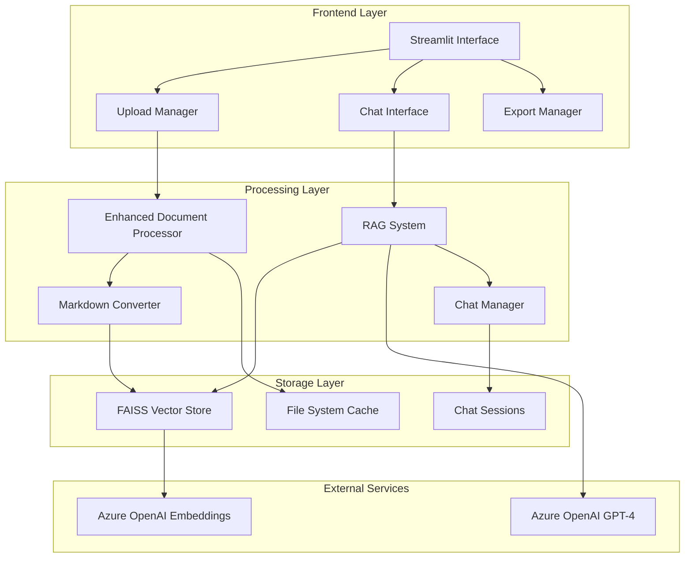
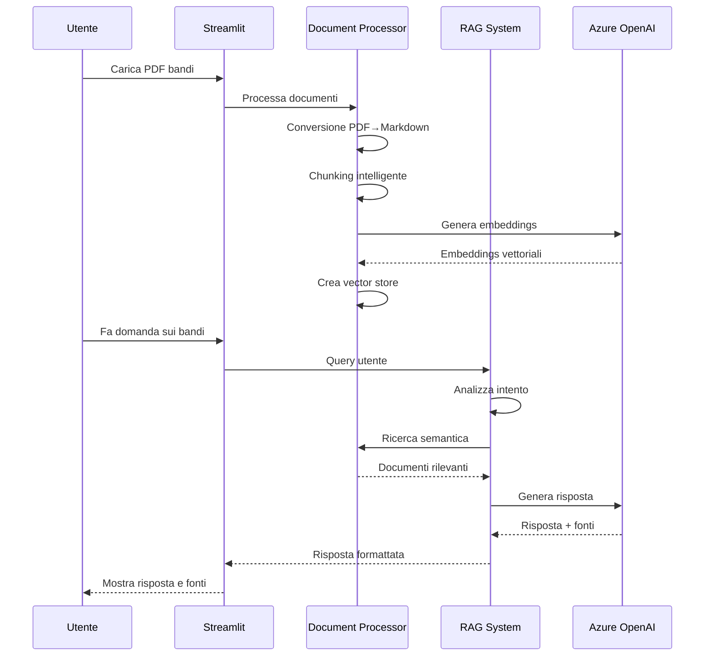

#  Bandi Assistant - Sistema RAG per Analisi Bandi Pubblici

Un sistema RAG (Retrieval Augmented Generation) avanzato progettato specificamente per l'analisi intelligente di bandi pubblici della **Regione Lombardia**. Il sistema utilizza conversione PDF-to-Markdown per una migliore comprensione dei documenti e Azure OpenAI per analisi semantiche precise.

##  Funzionalità Principali

###  Gestione Documenti Avanzata
- **Conversione PDF-to-Markdown**: Utilizza `pymupdf4llm` per preservare la struttura dei documenti
- **Vector Store Incrementale**: Un unico vector store globale che aggiunge solo nuovi file
- **Riconoscimento Automatico**: Evita di ricalcolare embeddings per file già processati
- **Processamento batch intelligente** con retry automatico per rate limits
- **Hash basato su contenuto**: Identifica univocamente ogni file tramite SHA-256
- **Suddivisione per pagine** opzionale per documenti complessi
- **Caricamento automatico** dalla cartella `data/` o upload manuale

###  Chat AI Intelligente
- **Analisi dell'intento utente** per distinguere domande sui bandi da chat generale
- **Memoria conversazionale persistente** con gestione sessioni multiple
- **Citazione automatica delle fonti** con anteprima del contenuto
- **Suggerimenti di ricerca intelligenti** basati sulla struttura Markdown
- **Modalità specializzate**: ricerca per idea progettuale, analisi comparativa

###  Analisi e Reporting
- **Tabella di sintesi editabile** con tutti i campi rilevanti dei bandi
- **Esportazione Excel/CSV** con formattazione personalizzata
- **Documento di sintesi automatico** (handbook completo)
- **Validazione automatica date** e determinazione stato aperto/chiuso
- **Report di debug** per monitoraggio qualità conversione

###  Caratteristiche Tecniche
- **Architettura modulare** con separazione responsabilità
- **Configurazione Azure OpenAI dedicata** per LLM ed embeddings
- **Sistema di logging completo** con rotazione file
- **Gestione errori robusta** con fallback automatici
- **Interfaccia Streamlit responsive** con logo personalizzato

##  Architettura del Sistema



##  Quick Start

### 1. Installazione

```bash
# Clona il repository
git clone <repository-url>
cd bandi-assistant

# Installa le dipendenze
pip install -r requirements.txt
```

### 2. Configurazione

Crea un file `.env` nella root del progetto:

```env
# Azure OpenAI per LLM
AZURE_ENDPOINT=https://your-resource.openai.azure.com/
AZURE_API_KEY=your_api_key_here

# Azure OpenAI per Embeddings (opzionale - può essere lo stesso)
AZURE_ENDPOINT_EMB=https://your-embedding-resource.openai.azure.com/
AZURE_API_KEY_EMB=your_embedding_api_key_here

# Configurazione modelli
AZURE_API_VERSION=2024-02-01
DEPLOYMENT_NAME=gpt-4o
AZURE_EMBEDDING_DEPLOYMENT_NAME=text-embedding-ada-002
```

### 3. Preparazione Dati

```bash
# Crea la struttura directory
mkdir -p data vector_store uploads exports logs

# Copia i PDF dei bandi nella cartella data/
cp /path/to/your/bandi/*.pdf data/
```

### 4. Avvio

```bash
streamlit run app.py
```

L'applicazione sarà disponibile su `http://localhost:8501`

##  Workflow Tipico



##  Configurazione Avanzata

### Parametri Document Processor

```python
# In config.py
CHUNK_SIZE = 1000          # Dimensione chunk per Markdown
CHUNK_OVERLAP = 200        # Sovrapposizione tra chunk
BATCH_SIZE = 50           # Batch per processing
BATCH_DELAY = 2           # Secondi tra batch
MAX_RETRIES = 3           # Retry per rate limits
```

### Opzioni Conversione Markdown

- **Conversione Markdown**: Migliore per documenti strutturati
- **Split per pagine**: Mantiene separazione pagine per riferimenti precisi
- **Fallback automatico**: Usa estrazione testo se conversione fallisce

##  Struttura Dati Estratti

### Tabella di Sintesi

| Campo | Descrizione | Esempio |
|-------|-------------|---------|
| Ente erogatore | Organizzazione responsabile | Regione Lombardia |
| Titolo dell'avviso | Nome ufficiale del bando | Bando per l'innovazione 2024 |
| Descrizione aggiuntiva | Obiettivi e finalità | Sostegno digitalizzazione PMI |
| Beneficiari | Chi può partecipare | PMI lombarde |
| Apertura | Data apertura bando | 15/01/2024 |
| Chiusura | Data scadenza | 30/06/2024 |
| Dotazione finanziaria | Budget totale | €5.000.000 |
| Contributo | Importo max per progetto | €100.000 |
| Key Words | Parole chiave | innovazione, digitale, PMI |
| Aperto (si/no) | Stato attuale | Si/No |

### Metadati Documenti

```json
{
  "source": "nome_bando.pdf",
  "content_type": "markdown",
  "conversion_method": "pymupdf4llm",
  "page": 1,
  "total_pages": 25,
  "markdown_path": "markdown_cache/nome_bando.md",
  "total_length": 15420
}
```

## 🔍 Esempi di Query

### Domande Generali
- "Quali sono i requisiti per partecipare al bando?"
- "Qual è la scadenza per presentare la domanda?"
- "Quali settori sono finanziabili?"

### Ricerca per Idea Progettuale
- "Ho un'idea per digitalizzare i processi aziendali con AI, quale bando è più adatto?"
- "Voglio aprire un centro di ricerca sull'energia rinnovabile, ci sono finanziamenti?"

### Analisi Comparative
- "Confronta i bandi disponibili per startup innovative"
- "Quali sono le differenze tra i bandi per PMI e grandi imprese?"

##  Struttura del Progetto

```
bandi-assistant/
├── 📁 src/                          # Moduli core
│   ├── 🐍 __init__.py              # Package init
│   ├── 🧠 rag_system.py            # Sistema RAG principale
│   ├── 📄 document_processor.py     # Processamento PDF→Markdown
│   ├── 💬 chat_manager.py          # Gestione sessioni chat
│   ├── ⚙️ config.py               # Configurazione sistema
│   └── 🛠️ utils.py                # Utilities comuni
├── 📁 data/                         # PDF bandi (input)
├── 📁 vector_store/                 # Cache embeddings
├── 📁 markdown_cache/               # Cache conversioni Markdown
├── 📁 chat_history/                 # Sessioni chat persistenti
├── 📁 exports/                      # File esportati
├── 📁 uploads/                      # Upload temporanei
├── 📁 logs/                         # Log applicazione
├── 📁 logo/                         # Assets UI
│   └── 🖼️ logo.png       # Logo Regione Lombardia
├── 🚀 app.py                       # Applicazione Streamlit
├── 📋 requirements.txt             # Dipendenze Python
├── 📖 README.md                    # Documentazione
└── ⚙️ .env                        # Configurazione (da creare)
```

##  Casi d'Uso Specifici

### 1. Analista di Bandi
- Carica tutti i bandi della regione
- Genera tabella di sintesi completa
- Esporta in Excel per analisi ulteriori
- Crea report di sintesi per i decisori

### 2. Imprenditore in Cerca di Finanziamenti
- Descrive la propria idea progettuale
- Riceve suggerimenti sui bandi più adatti
- Verifica requisiti e scadenze
- Ottiene informazioni su budget e cofinanziamento

### 3. Consulente per Bandi
- Utilizza chat per rispondere a clienti
- Mantiene cronologia delle consulenze
- Esporta conversazioni per follow-up
- Genera report personalizzati per settore

##  Troubleshooting

### Rate Limits Azure OpenAI
Il sistema include retry automatici con exponential backoff. Se persiste:
- Verifica i limiti del tuo account Azure
- Considera l'upgrade del tier di servizio
- Utilizza endpoint dedicati per embeddings

### Errori di Conversione PDF
- Verifica che i PDF non siano protetti da password
- Alcuni PDF scansionati potrebbero richiedere OCR
- Il sistema include fallback automatico per PDF problematici

### Problemi di Memoria
- Riduci `CHUNK_SIZE` in `config.py`
- Processa meno file contemporaneamente
- Verifica spazio disponibile per cache

##  Aggiornamenti e Manutenzione

### Pulizia Cache
```bash
# Pulisci cache vector store
rm -rf vector_store/*

# Pulisci cache Markdown
rm -rf markdown_cache/*

# Pulisci upload temporanei
rm -rf uploads/*
```

### Backup Dati
```bash
# Backup chat sessions
cp -r chat_history/ backup/chat_history_$(date +%Y%m%d)/

# Backup configurazioni
cp .env backup/
```

##  Contributi

Per contribuire al progetto:
1. Fork del repository
2. Crea branch feature (`git checkout -b feature/nuova-funzionalita`)
3. Commit delle modifiche (`git commit -am 'Aggiunge nuova funzionalità'`)
4. Push del branch (`git push origin feature/nuova-funzionalita`)
5. Apri una Pull Request

##  Licenza

Questo progetto è sviluppato per la **Regione Lombardia** nell'ambito dell'iniziativa LombardIA per l'innovazione digitale della Pubblica Amministrazione.

---

**Bandi Assistant** - Innovazione digitale per la Pubblica Amministrazione Lombarda 🏛️

##  Vector Store Incrementale

Il sistema è stato ottimizzato per utilizzare un unico vector store incrementale che:

1. **Evita duplicazioni**: Il sistema calcola un hash SHA-256 univoco per ogni file basato su contenuto e data di modifica
2. **Riutilizzo vettori**: I file già processati vengono riconosciuti e saltati automaticamente
3. **Aggiunta incrementale**: Solo i nuovi file vengono processati e aggiunti al vector store esistente
4. **Persistenza globale**: Un unico vector store persiste tra diverse sessioni e upload
5. **Metadati completi**: Viene mantenuto un registro di tutti i file processati con timestamp
6. **Robustezza**: Il sistema gestisce errori di caricamento e corruzione con meccanismi di recovery

Questa architettura garantisce:
- Miglior efficienza computazionale (nessun ricalcolo inutile)
- Minore utilizzo di API OpenAI (solo per nuovi file)
- Esperienza utente migliorata (caricamento più veloce)
- Maggiore coerenza nelle risposte (stesso vector store per tutte le domande)