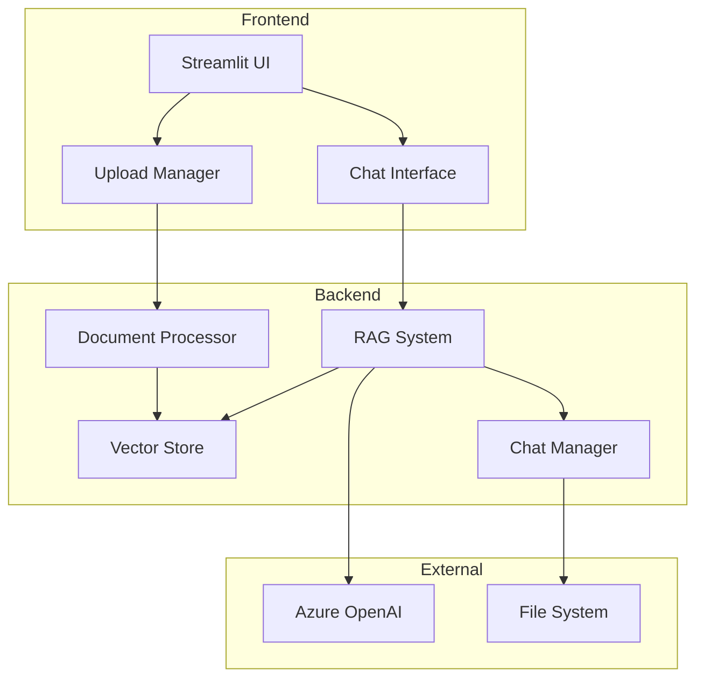
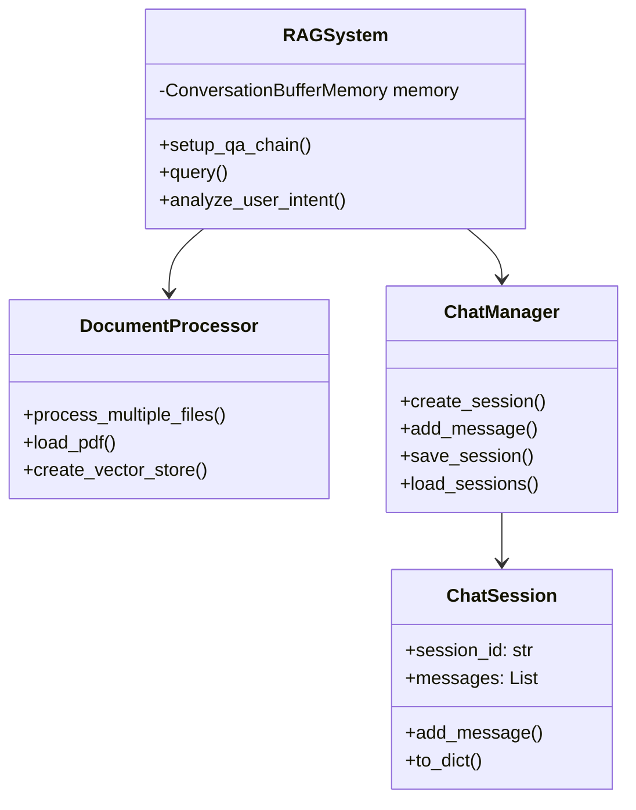
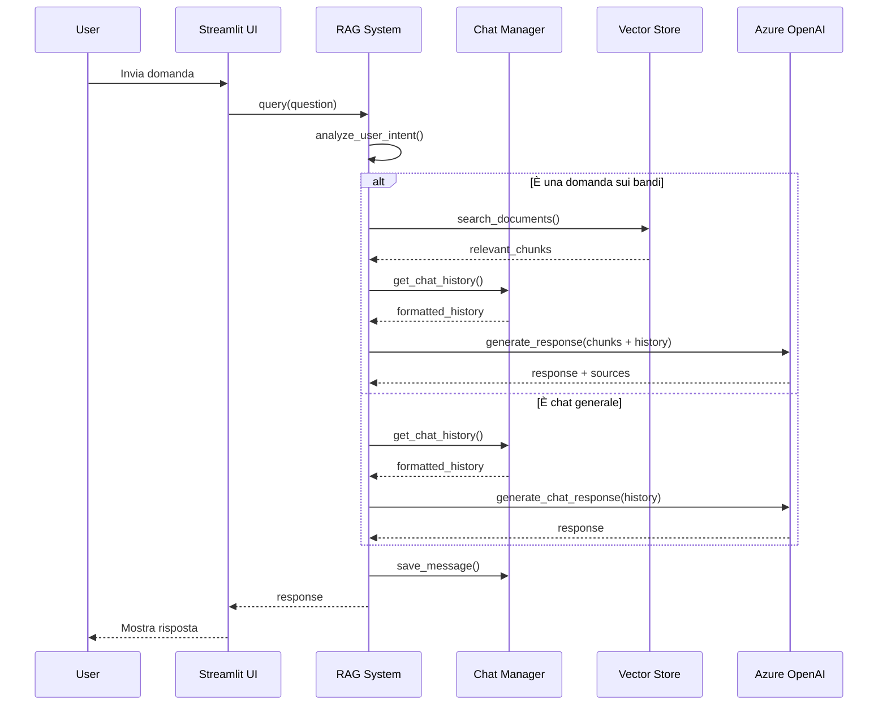
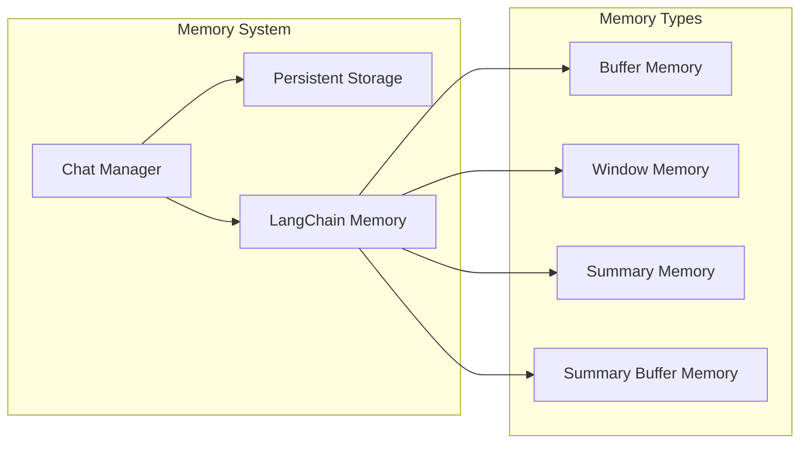

# Sistema RAG per Analisi Bandi Pubblici

Un sistema RAG (Retrieval Augmented Generation) per l'analisi intelligente di bandi pubblici, che permette di:
- Caricare e processare documenti PDF di bandi
- Fare domande in linguaggio naturale sui bandi
- Ottenere risposte precise con riferimenti alle fonti
- Generare tabelle di sintesi e documenti riassuntivi

## Architettura del Sistema



## Componenti Principali



## Workflow di una Query



## Sistema di Memoria



## Funzionalità Principali

1. **Gestione Documenti**
   - Caricamento multiplo di PDF
   - Processamento e chunking automatico
   - Creazione embeddings con Azure OpenAI
   - Storage vettoriale per ricerca semantica

2. **Sistema RAG**
   - Analisi semantica dell'intento utente
   - Retrieval contestuale dei documenti
   - Generazione risposte con citazione fonti
   - Memoria conversazionale intelligente

3. **Gestione Chat**
   - Sessioni multiple
   - Persistenza su file system
   - Memoria conversazionale
   - Esportazione chat in vari formati

4. **Funzionalità Avanzate**
   - Tabella di sintesi dei bandi
   - Ricerca per idea progettuale
   - Documento di sintesi automatico
   - Analisi semantica delle domande

## Setup e Configurazione

1. Installare le dipendenze:
```bash
pip install -r requirements.txt
```

2. Configurare le variabili d'ambiente in `.env`:
```env
AZURE_API_KEY=your_key
AZURE_ENDPOINT=your_endpoint
AZURE_API_VERSION=2024-02-01
DEPLOYMENT_NAME=your_deployment
```

3. Avviare l'applicazione:
```bash
streamlit run app.py
```

## Struttura Directory

```
project/
├── src/
│   ├── __init__.py
│   ├── ai_processor.py
│   ├── chat_manager.py
│   ├── config.py
│   ├── document_processor.py
│   ├── rag_system.py
│   └── utils.py
├── data/
│   └── processed/
├── docs/
│   ├── ARCHITECTURE.md
│   └── API.md
├── tests/
│   └── test_*.py
├── app.py
├── requirements.txt
└── README.md
```